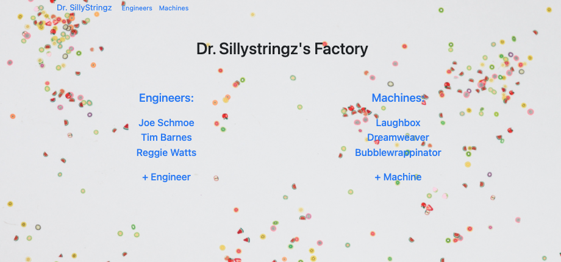
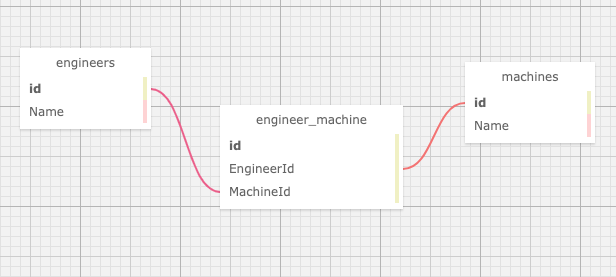

# Dr. Sillystringz

#### Friday Project for Epicodus using a Many-to-Many relationship , 1.8.2020

#### By Bess Campbell 

## Description

 You've been contracted by the factory of the famous Dr. Sillystringz to build an application to keep track of their machine repairs. You are to build an MVC web application to manage their engineers, and the machines they are licensed to fix. The factory manager should be able to add a list of engineers, a list of machines, and specify which engineers are licensed to repair which machines. There should be a many-to-many relationship between Engineers and Machines. An engineer can be licensed to repair (belong to) many machines (such as the Dreamweaver, the Bubblewrappinator, and the Laughbox) and a machine can have many engineers licensed to repair it.

## User Stories

 * As the factory manager, I need to be able to see a list of all engineers, and I need to be able to see a list of all machines.
 * As the factory manager, I need to be able to select a engineer, see their details, and see a list of all machines that engineer is licensed to repair. I also need to be able to select a machine, see its details, and see a list of all engineers licensed to repair it.
 * As the factory manager, I need to add new engineers to our system when they are hired. I also need to add new machines to our system when they are installed.
 * As the factory manager, I should be able to add new machines even if no engineers are employed. I should also be able to add new engineers even if no machines are installed
 * As the factory manager, I need to be able to add or remove machines that a specific engineer is licensed to repair. I also need to be able to modify this relationship from the other side, and add or remove engineers from a specific machine.
 * I should be able to navigate to a splash page that lists all engineers and machines. Users should be able to click on an individual engineer or machine to see all the engineers/machines that belong to it.

## Preview



## Prerequisites

### Software Requirements

• A browser like [Chrome](https://www.google.com/chrome/)

• A code editor like [VSCode](https://code.visualstudio.com/download)

• With [.NET Core 2.2](https://dotnet.microsoft.com/download/dotnet-core/thank-you/sdk-2.2.106-macos-x64-installer) installed

• [MySQL](https://dev.mysql.com/downloads/file/?id=484914) **Instructions for setup below**

• [MySQL Workbench](https://dev.mysql.com/downloads/file/?id=484391) **Instructions for setup below**

#### MySQL & MySQL Workbench Setup instructions

* Download the [MySQL Community Server](https://dev.mysql.com/downloads/file/?id=484914). Click the 'No thanks, just start my download' link.
* Follow along with the installer until you reach the Configuration page. Then select the following options:
  * Use Legacy Password Encryption.
  * Set password to **epicodus** or to your own personlized password.
  * Click Finish.

* Open the terminal and enter the command `echo 'export PATH="/usr/local/mysql//bin:$PATH"'>>~/.bash_profile`
* Type `source ~/.bash_profile` in the terminal to verify that MySQL was installed.
* Enter `mysql -uroot -pepicodus` or `mysql -uroot -p{your_password}` in the terminal to verify the installation. You will know it's installed when you gain access to the `mysql>` command line.
* Download the [MySQL Workbench](https://dev.mysql.com/downloads/file/?id=484391) file using the 'No thanks, just start my download' link.
* Install MySQL Workbench in the Applications folder.
* Open MySQL Workbench and select the `Local instance 3306` server. You will need to enter the password **epicodus** (or the password you set). 

#### Setup and Use (cloning)

 * Open your terminal and ensure you are within the directory you'd like the file to be created in.
 * Enter the following command `$ git clone https://github.com/besscampbell/Sillystringz.git`
 * Once cloned, use the `$ cd Sillystringz.Solution/Sillystringz` command to navigate to the project directory.
 * Enter `$ dotnet restore`

#### Import database with Entity Framework Core
* Now enter `$ dotnet ef database update` to create database in MySQL.
* To run the console application, enter `$ dotnet run`
* Your command line will open a server (likely `http://localhost:5000/`). Navigate to this URL in your browser to view the project.

#### Import Database with MySQL Workbench
* In the top toolbar of MySQL Workbench, click on `Server -> Data Import`.
* Select option for `Import from Self-Contained File`.
* Set the `Default Target Schema` or create a new schema.
* Select Schema Objects you wish to import.
* Ensure the option `Dump Structure and Data` is selected (located near the bottom).
* Click `Start Import`

#### Import Database with SQL Schema
* Open MySql Workbench and paste the following Schema Create Statement into a new SQL tab for executing queries.

```
CREATE DATABASE `bess_campbell_factory` /*!40100 DEFAULT CHARACTER SET utf8mb4 COLLATE utf8mb4_0900_ai_ci */;
USE `bess_campbell_factory`;

DROP TABLE IF EXISTS `__EFMigrationsHistory`;
CREATE TABLE `__EFMigrationsHistory` (
  `MigrationId` varchar(95) NOT NULL,
  `ProductVersion` varchar(32) NOT NULL,
  PRIMARY KEY (`MigrationId`)
) ENGINE=InnoDB DEFAULT CHARSET=utf8mb4 COLLATE=utf8mb4_0900_ai_ci;

DROP TABLE IF EXISTS `EngineerMachine`;
CREATE TABLE `EngineerMachine` (
  `EngineerMachineId` int(11) NOT NULL AUTO_INCREMENT,
  `EngineerId` int(11) NOT NULL,
  `MachineId` int(11) NOT NULL,
  PRIMARY KEY (`EngineerMachineId`),
  KEY `IX_EngineerMachine_EngineerId` (`EngineerId`),
  KEY `IX_EngineerMachine_MachineId` (`MachineId`),
  CONSTRAINT `FK_EngineerMachine_Engineers_EngineerId` FOREIGN KEY (`EngineerId`) REFERENCES `engineers` (`EngineerId`) ON DELETE CASCADE,
  CONSTRAINT `FK_EngineerMachine_Machines_MachineId` FOREIGN KEY (`MachineId`) REFERENCES `machines` (`MachineId`) ON DELETE CASCADE
) ENGINE=InnoDB AUTO_INCREMENT=8 DEFAULT CHARSET=utf8mb4 COLLATE=utf8mb4_0900_ai_ci;

DROP TABLE IF EXISTS `Engineers`;
CREATE TABLE `Engineers` (
  `EngineerId` int(11) NOT NULL AUTO_INCREMENT,
  `Name` longtext,
  PRIMARY KEY (`EngineerId`)
) ENGINE=InnoDB AUTO_INCREMENT=5 DEFAULT CHARSET=utf8mb4 COLLATE=utf8mb4_0900_ai_ci;

DROP TABLE IF EXISTS `Machines`;
CREATE TABLE `Machines` (
  `MachineId` int(11) NOT NULL AUTO_INCREMENT,
  `Name` longtext,
  PRIMARY KEY (`MachineId`)
) ENGINE=InnoDB AUTO_INCREMENT=5 DEFAULT CHARSET=utf8mb4 COLLATE=utf8mb4_0900_ai_ci;

```
#### SQL Database Design




## Technologies Used

_This application required use of the following programs/languages/libraries to create:_
* _GitBash_
* _Visual Studio Code_
* _GitHub_
* _C# v 7.3_
* _.NET Core v 2.2_
* _ASP.NET Core MVC_
* _Bootstrap_
* _CSS_
* _cshtml_
* _MySQL_
* _MySQL Workbench_
* _Entity Framework Core_
* _[SQL Designer](https://ondras.zarovi.cz/sql/demo/)_

## Known Bugs

No known bugs.

## Support and contact details

Feel free to contact <bess.k.campbell@gmail.com>

## License

_MIT_ Copyright (c) 2020 *_Bess Campbell_*